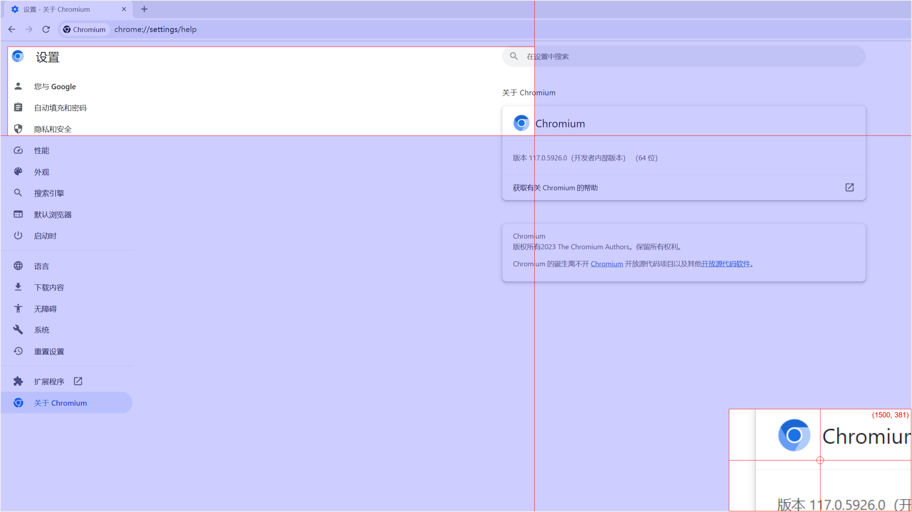

# light_capture
A light weight snapshot tool for Linux.



## Why
I am writing this because I need a snapshot tool like QQ embeded one.
Under linux, we have the following tools;
- gnome-screenshot
  - Pro: Installed by gnome interface linux.
  - Con: Terminal based, cannot draw something after capture.
- scrot
  - Pro: Many functions with commands, light-weight.
  - Con: The same as gnome-screenshot.
- [shutter](https://shutter-project.org/)
  - Pro: Rich function for edit, and the editor is not heavy like GIMP but has enough functions, I really like it.
  - Con: Official deb for Ubuntu not provided, apt source blocked in may company, need extra dependencies if you want to use its editor.
    ```
    sudo add-apt-repository ppa:shutter/ppa
    sudo apt-get update #for Linux Mint only, this is done automatically on Ubuntu
    sudo apt install shutter
    # Fix eidtor
    curl -o FixShutterEdit.sh https://raw.githubusercontent.com/letsfoss/Fix-Disabled-Edit-Option-In-Shutter/master/FixShutterEdit.sh; chmod +x FixShutterEdit.sh; ./FixShutterEdit.sh
    ```
- [flameshot](https://flameshot.org/)
  - Pro: I think it is ideal tool.
  - Con: Depends on QT while the QT version does not match my development version, I do not want to take risk to reinstall QT. (AppImage can solve it but does not work on the clipboard)

So I just want a easy tool for this:
1. Light enough
2. Portable

# Features
1. Little dependency: xclip(for clipboard), Pillow(Python, need install), tkinter(Python installed by default)
2. Portable, the dependency upon is available on most Linux systems.

# Functions
- [ ] move
- [x] rectangle
- [ ] circle
- [x] arrow
- [ ] number
- [ ] pencel
- [ ] pen
- [ ] font
- [ ] blur
- [ ] erasor
- [ ] undo
- [ ] redo
- [ ] open
- [x] abort
- [x] save
- [x] clipboard
- [ ] sub-menu for draw property
- [ ] put window always on top
- [ ] centralized configuration management
- [ ] use gnomescreenshot/scrot for snapshot and edit by this tool(use as merely front end)
...

Maybe I will finish them with my trivial time out of work.
Welcome to provide good ideas but I am not assure will finish them.
Light & Portable, which is this tools target.

# Bugs
1. Keyboard not work on Ubuntu(but work on Windows)
2. Windows clipboard support.(I think I don't need this tool on windows...)
